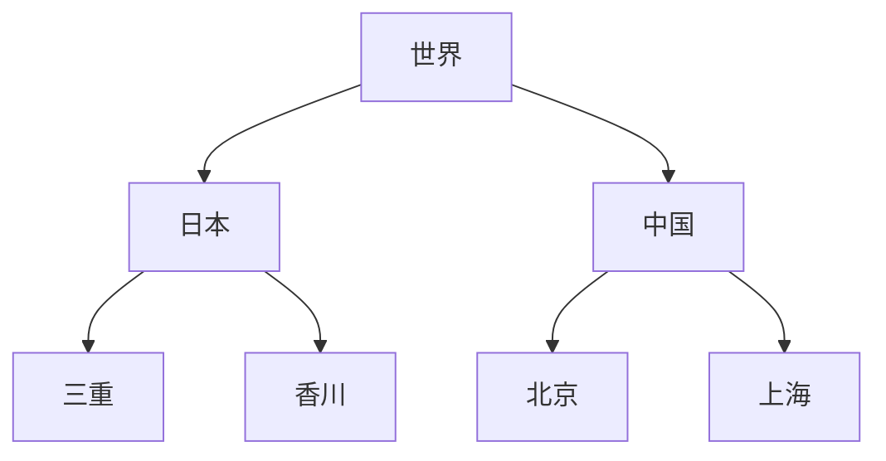

+++
title = "『達人に学ぶ DB 設計 徹底指南書』でデータベース設計の論理と物理を考える"
date = 2023-05-05
tags = ["database", "sql"]
cover.image = "https://source.unsplash.com/https://unsplash.com/ko/@miabruning16"
+++


[『達人に学ぶ DB 設計 徹底指南書』](https://www.shoeisha.co.jp/book/detail/9784798124704) はリレーショナルデータベース (RDB) の設計についての解説書です. [『達人に学ぶ SQL 徹底指南書』](https://www.shoeisha.co.jp/book/detail/9784798157825) の続編という位置づけのようなので, 本書に登場する SQL が難しいと思ったり, より SQL のことを学びたいと思ったら前作を読むと良いでしょう.  

本書ではデータベースの設計を, エンティティの定義や正規化などを行う論理設計と, データ格納の方法や場所を考える物理設計の二段階に分けて説明します. 設計についての基本的な考え方や知識を抑えつつ, やってしまいがちなバッドノウハウや, 論理設計と物理設計のトレードオフと言った実践的な内容にも踏み込みます.


## 正規化

データベース設計は大きく論理設計と物理設計という二段階に分かれる. 最初に行う論理設計では, 特定の DBMS(Database Management System) や SQL のことは考えずに, プログラムが扱う対象となる物事の属性や物事同士の関係をモデル化する.  
論理設計をするに当たって役に立つのが, データの冗長性や非一貫性を排除するための正規化という方法だ.

正規化を理解するには正規化されていないデータを題材にすると分かりやすい. 例えば以下のテーブルは, 都道府県, 市町村, 市町村の規模を表している. このように分割しておけば先に挙げた問題は起きない.

```
+-----------+-----------+-----------+-----------+-----------+--------+
| pref_code | pref      | city_code | city      | area_code | area   |
+-----------+-----------+-----------+-----------+-----------+--------+
| 01        | Aomori    | 01        | Hirosaki  | 01        | Large  |
| 01        | Aomori    | 02        | Hatinohe  | 01        | Large  |
| 01        | Aomori    | 03        | Misawa    | 03        | Small  |
| 02        | Yamaguchi | 04        | Ube       | 01        | Large  |
| 02        | Yamaguchi | 05        | Kudamatsu | 02        | Middle |
| 02        | Yamaguchi | 06        | Mine      | 03        | Small  |
+-----------+-----------+-----------+-----------+-----------+--------+
```

このテーブルには `01 Aomori` のように何度も登場するデータがあって冗長だ. さらに, データの整合性が取れなくなる場合があるのが大きな問題だ. 例えば `02 Aomori` というレコードがあったら, 県コードと県名のどちらを信用すればよいのか.  
こういった冗長性や非一貫性を排除するためには, テーブルを分割するのが有効だ.

```
-- prefs
+-----------+-----------+
| pref_code | pref      |
+-----------+-----------+
| 01        | Aomori    |
| 02        | Yamaguchi |
+-----------+-----------+

-- cities
+-----------+-----------+-----------+-----------+
| city_code | city      | pref_code | area_code |
+-----------+-----------+-----------+-----------+
| 01        | Hirosaki  | 01        | 01        |
| 02        | Hatinohe  | 01        | 01        |
| 03        | Misawa    | 01        | 03        |
| 04        | Ube       | 02        | 01        |
| 05        | Kudamatsu | 02        | 02        |
| 06        | Mine      | 02        | 03        |
+-----------+-----------+-----------+-----------+

-- areas
+-----------+--------+
| area_code | area   |
+-----------+--------+
| 01        | Large  |
| 02        | Middle |
| 03        | Small  |
+-----------+--------+
```

元のテーブルを復元するにはテーブル結合を使う.

```sql
select
  p.pref_code, p.pref,
  c.city_code, c.city,
  a.area_code, a.area
from
  prefs as p
  inner join cities as c
    on p.pref_code = c.pref_code
  inner join areas as a
    on c.area_code = a.area_code;
```

これが正規化だが, 言われてみれば当たり前だと思う. 「正規化」という言葉を知らなくても自力でこのような設計を行うことは可能だろう.  
しかし, 当たり前を厳密に記述することに理論の意味がある. 正規化はレベルに応じて第一から第五までに分類されているが, そういう分類は理論的な考察によって生まれるものだろう.  
正規化なんて理論上だけのものだとは思わずに, 自分で設計を行うときにも考えの補助として使えそうだ. このテーブルは第三正規化を満たしているだろうか, この設計は第二正規化をしていないから違和感があるのだ, というふうに.

## 論理と物理のトレードオフ

論理設計を受けて, 実際にデータをどのように格納するかを考えるのが物理設計というフェーズだ. 具体的にはテーブル定義やインデックス定義, RAID 構成やファイルの保存場所などを考える.  
論理設計と物理設計にはトレードオフが発生することがある. 論理設計の綺麗さを優先するとパフォーマンスが落ちる, パフォーマンスを優先すると論理設計が壊れるといった具合だ.

なぜ綺麗な論理設計がパフォーマンスを落とすのかというと, 正規化をするとテーブル結合が必要になるからだ. 正規化はテーブルを分割する行為なので元に戻すには必然的にテーブル結合をしなければならない. 結合は負荷の高い処理なので, しばしばパフォーマンス上の問題となる. 論理を取るか物理を取るかというジレンマが発生する.

例えば, あえて正規化をせずに結合した状態のテーブルを保持しておく, テーブルの一部のレコードやカラムを切り出したテーブル (データマート) を作成しておく, 巨大なテーブルのレコードを分割して複数のテーブルに分散させるといったノウハウが存在する.

本書が取るのは, 論理と物理のトレードオフが発生することは承知の上で, 原則として論理を優先させるべきというものだ. 非正規化は本当の本当の最終手段としてしか認めない. 非正規化によるデメリット (データの冗長性, 非一貫性, 更新コスト増大など) を重く見るのだ.  
ではどうやってパフォーマンスを達成するかというと, 適切なインデックスを定義したり, パーティションやマテリアライズドビューといった機能を利用する方法が挙げられる.

### パーティション

テーブルを分割して別のファイルに保存する機能. 分割の方向によって水平と垂直という二種類の分割がある. 水平分割はレコードを分割する, 垂直分割はカラムを分割するということだ.

パーティションはテーブルのサイズが大きすぎてパフォーマンスが悪化している場合に利用する.  
水平分割の恩恵として [パーティションプルーニング](https://dev.mysql.com/doc/refman/8.0/ja/partitioning-pruning.html) がある. 結果に含まれるレコードが特定のパーティションのみに含まれる場合, 一部のパーティションのファイルのみを見れば良いため, テーブルフルスキャンよりファイル IO のコストを抑えられる.  
パフォーマンス外の利点として, 物理的に一つのストレージに収まらないテーブルを複数のストレージに分けて保存することができる, パーティションごとにファイルのバックアップを取ることが容易になるといったものがある.

### マテリアライズドビュー

実ファイルを持ったビュー. ビューはテーブルを増やさずに実質的に新たなテーブルを作るようなものなので便利だが, 毎回元のテーブルにアクセスするのでパフォーマンス上のデメリットがある. 特にビューからビューを参照する多段ビューはバッドノウハウとして本書で紹介されている.

マテリアライズドビューは実態を持っているので, 元のテーブルを参照する必要もないし, インデックスを付与することもできる. 欠点としてはストレージ消費や, 元のテーブルのデータを反映するために更新が必要といった特徴がある. 常に最新のデータが必要というわけではないような場合には非常に便利そうだ.

## 木構造

RDB では木構造が扱いづらいことが大きな弱点とされてきたが, 弱点を克服すべくいくつかの方法が考えられている. 代表的な 2 つのモデル, 入れ子集合モデルとパス列挙モデルを紹介しよう.

具体的な木構造としては以下のようなものを想像して欲しい.



### 入れ子集合モデル

ノードを点ではなく面積を持つ集合として表現するのが入れ子集合モデルのアイデアだ. 本書では「面積を持つ集合」とされているが, 個人的には「幅を持つ区間」で十分ではないかと思うので, 一次元で説明する.

```
|----------------------World---------------------------|
 |-------Japan----------||------------China-----------|
  |---Mie--||--Kagawa--|  |--Beijing--||--Shanghai--|
```

テーブルは以下のようになる. 各ノードが左端と右端を持っていて, 子ノードは親ノードに内包されている.

```
+----------+---------+---------+
| name     | l       | r       |
+----------+---------+---------+
| World    |       1 |      14 |
| Japan    |       2 |       7 |
| Mie      |       3 |       4 |
| Kagawa   |       5 |       6 |
| China    |       8 |      13 |
| Beijing  |       9 |      10 |
| Shanghai |      11 |      12 |
+----------+---------+---------+
```

このモデルを使って, いくつかの操作を考えてみよう.

- ルートノードを得る
  - 自身を内包するノードが存在しないノードを探す

```sql
select
  *
from
  nodes as n1
where
  not exists
  (
    select *
    from nodes as n2
    where n2.l < n1.l and n1.r < n2.r
  );
```

- リーフノードを得る
  - 自身が内包するノードが存在しないノードを探す

```sql
select
  *
from
  nodes as n1
where
  not exists
  (
    select *
    from nodes as n2
    where n1.l < n2.l and n2.r < n1.r
  );
```

- 深さを得る
  - 深さ = 自身を内包するノードの数

```sql
select
  n1.name, count(*)
from
  nodes as n1
  inner join nodes as n2
    on n2.l <= n1.l and n1.r <= n2.r
group by
  n1.name;
```

基本的な操作が行えることが分かったが, ノードの追加は少し難しい. 日本と中国の間に韓国を追加することを考えよう.

```
|----------------------World---------------------------|
 |-------Japan----------||------------China-----------|
```

```
+----------+---------+---------+
| name     | l       | r       |
+----------+---------+---------+
| World    |       1 |      14 |
| Japan    |       2 |       7 |
| China    |       8 |      13 |
+----------+---------+---------+
```

なんと, 日本と中国の間に隙間がないのでノードを追加できない！ように見えるが, それは整数の範囲で考えているからで, 実数にまで拡張すれば隙間はある. ちょうど日本と中国間の隙間を三等分する点を挿入する.

```sql
insert into nodes values(
  'Korea',
  ( -- 7.33...
    (select r from nodes as t where name = 'Japan') * 2
    + (select l from nodes as t where name = 'China')
  ) / 3.0,
  ( -- 7.66...
    (select r from nodes as t where name = 'Japan')
    + (select l from nodes as t where name = 'China') * 2
  ) / 3.0
);
```

ノードの追加は他のノードに影響を与えないし, 非常に簡単に実現できる. しかし, 小数を使うと範囲が実数の有効桁数に制限されてしまう.  
欠点らしい欠点がないように思える入れ子集合モデルだが, 実用するためには十分な有効桁数が必要だ.

### 経路列挙モデル

ファイルシステムは木構造を扱っている. そこから着想を得た, 階層構造をパスで表現するというコロンブスの卵的なアイデアが経路列挙モデルだ.

```
+----------+----------------------------+
| name     | path                       |
+----------+----------------------------+
| World    | /World/                    |
| Japan    | /World/China/Japan/        |
| Mie      | /World/China/Japan/Mie/    |
| Kagawa   | /World/China/Japan/Kagawa/ |
| China    | /World/China/              |
| Beijing  | /World/China/Beijing/      |
| Shanghai | /World/China/Shanghai/     |
+----------+----------------------------+
```

先ほどと同様に, いくつかの操作を実現する SQL を見てみよう.

- ルートノードを得る
  - `path` から `/` を除くと `name` と一致する

```sql
select *
from nodes
where name = replace(path, '/', '');
```

- 深さを得る
  - 区切り文字 `/` の数から計算できる

```sql
select
  name,
  length(path) - length(replace(path, '/', '')) - 1
from
  nodes;
```

- あるノードの親を列挙する
  - 子のパスは親のパスを含んでいる点を利用して LIKE 検索

```sql
select
  *
from
  nodes as n1
  inner join nodes as n2
    on n1.path like concat(n2.path, '%')
where
  n1.name = 'Beijing';
```

更新はやや複雑になる. 例えば日本を中国以下に移動させるには, 日本以下のノードのパスすべてを更新しなければならない.

```sql
update
  nodes
set
  path = replace(path, '/Japan/', '/China/Japan/')
where
  path like '%/Japan/%'
```

ファイルシステムに慣れている身からすると馴染みやすい発想の経路列挙モデルだが, 欠点を挙げると以下のものがある.

- 兄弟同士の順序関係を表現できない
- 巨大な木構造だとパス長が長くなりすぎる
  - その場合はパスに ID を振って `1.2.2.3` のようにパスを表現すればある程度対策可能
- 親の追加やノードの移動などの更新が複雑

入れ子集合モデルに比べて欠点が多いようにも見えるが, これらが大して問題にならない場合もあるだろう. 論理と物理同様, やはりトレードオフを考慮してどのモデルを採用するか決めなければならない.

## 結び

正規化, ER 図, RAID 構成といった基本的な事柄を説明しつつ, インデックスの使いどころや現場で見られるバッドノウハウとその対策などの実践的な内容も含まれていて勉強になりました. 最終章である木構造の話は全体からするとやや浮いているようにも思えましたが, 内容としては面白かったため記事でも紹介しました.

本書で繰り返し強調されていたのは論理と物理のトレードオフです. [銀の弾などない](https://ja.wikipedia.org/wiki/%E9%8A%80%E3%81%AE%E5%BC%BE%E3%81%AA%E3%81%A9%E3%81%AA%E3%81%84) と言われますが, DB 設計にもまさに当てはまる警句です.  
トレードオフを理解することが設計に立ち向かうスタート地点だと思うので, 次は物理, つまり DBMS の中身を学びたいと思いました.
